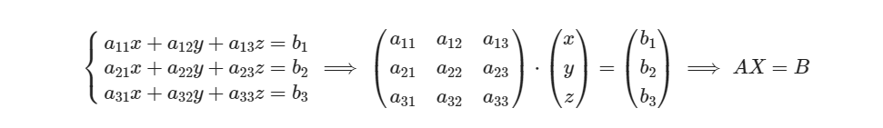

## Постановка
Требуется разработать программу которая реализует обобщённую логику решения матричных и линейных уравнений. Предлагается разработать алгоритмы решения уравнений:
1. Матричных вида AX=B
2. Линейных уравнений вида 
   
Программа должна реализовывать классы матрицы и вектора (как производного от матрицы в общем случае).
Класс Матрицы должен хранить базовую информацию о ней: значения, размеры и размерность. 
Должны быть реализованы следующие методы реализующие действия над матрицей:

1. Инициализация матрицы
	1. Пустой, но по известным размерам
	2. Двумерным массивом (вектором)
	3. Другой матрицей
2. Получение 
	1. Размеров матрицы
	2. Размерности
	3. Элементов по индексам
	4. Массива (Вектора) элементов строк или колонок по индексу
	5. Двумерного массива (вектора) элементов
	6. Текстового представления (для печати)
3. Запись
	1. Значения элемента по индексу
	2. Значений элементов строк или колонок по индексу в виде массива (вектора)
4. Изменение размерности (безопасное или нет)
5. Проверка
	1. Матрица единичная?
	2. Матрица квадратная?
6. Базовые операции (через перегрузку операторов)
	1. Получение и изменение значение элемента через оператор круглые скобки
	2. С матрицами
		1. Сложение
		2. Вычитание
		3. Скалярное умножение
		4. Сравнение (равенство, не равенство)
	3. Со скалярными значениями
		1. Умножение
		2. Деление
7. Операции над матрицей (через функции)
	1. Вычисление определителя матрицы
	2. Получение транспонированной матрицы
	3. Получение матрицы минора для элемента по индексу
	4. Получение определителя матрицы минора для элемента по индексу
	5. Получение матрицы минора для соответствующих элементам и их индексу
	6. Получение алгебраического дополнения для элемента по его индексу
	7. Получение матрицы алгебраических дополнений
	8. Получение обратной матрицы
8. Решение матричного уравнения

Дополнительно требуется описать класс Вектор, который так же реализует удобное взаимодействие с векторами, и позволит представить многомерные матрицы, как линейные вектора тогда, когда в одном из направлений, размерность равна 1.

После реализации классов, требуется написать тесты - примеры работы с функциями, чтобы подтвердить их работоспособность и зафиксировать корректное поведение.

## Критерии приёмки

Тестовый запуск программы и перепроверка корректности рассчитанных значений. Демонстрация реализованных методов и функций. Ответы на вопросы по работе программы.
  
## Источники для выполнения дз
http://www.mathprofi.ru/matrichnye_uravneniya_primery_reshenij.html
